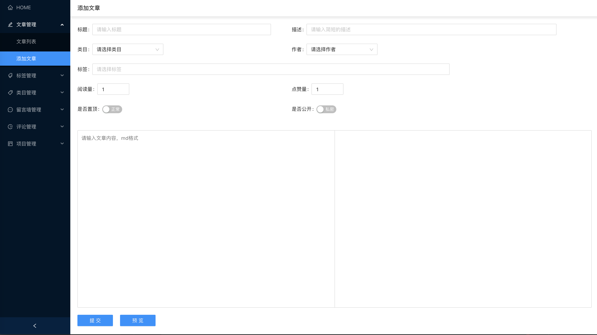

## 简述
这是博客后台管理系统，利用react + typescript + react-router + hooks + ant design  具体模块有:

1. 登录、退出
2. 文章管理
   - 文章修改，删除
   - 添加文章
3. 标签管理
   - 新增、修改、删除标签
4. 留言墙管理
   - 新增、修改、删除留言
5. 文章评论管理
   - 新增、修改、删除留言
6. 项目管理
   - 新增、修改、删除留言

## 相关链接

博客地址：[Pydw-blog](https://github.com/naihe138/naice-blog)

博客管理：[Pydw-blog-admin](https://github.com/naihe138/naice-blog-admin)

博客后台：[python-tornado](https://github.com/naihe138/naice-blog-koa)


### 后台相关截图：





### 相关技术栈：

+ react + redux + react-router + ant design
+ token控制

### server

+ python + tornado + mysql
+ 鉴别参数是否正确
+ jwt登录权限
+ Surpervisor 进程守护
+ ....


### 未来可能加入

+ ～移动适配～
+ 页面数据可视化统计
+ react-native
+ ....

### Dev

````
npm start
````

### Build

````
npm run build
````


如在浏览中遇到任何的bug，请留言我，我会第一时间修复，就此先谢谢

特别鸣谢：naihe  github: https://github.com/naihe138